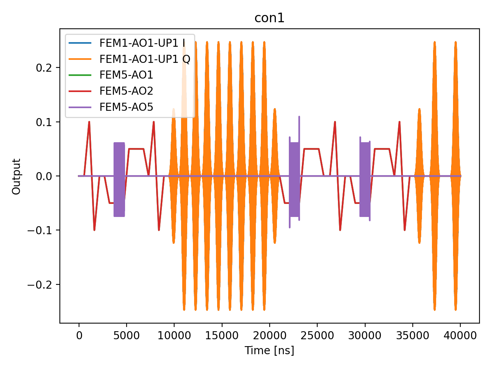

# 13_xy8

## Description

        XY8 DYNAMICAL DECOUPLING T2 MEASUREMENT - using standard QUA (pulse > 16ns and 4ns granularity)
The goal of this script is to measure the qubit coherence time under XY8 dynamical decoupling.
The XY8 sequence applies 8 refocusing pi pulses with alternating X and Y rotation axes,
using CPMG timing (half-intervals at bookends, full intervals between pulses).

Unlike the Hahn echo (single pi pulse), XY8 filters higher-frequency noise components
and cancels pulse imperfections to first order through the XYXY·YXYX alternation pattern.
The resulting T2_XY8 is typically longer than T2_echo (Hahn echo) and reflects the
coherence limit set by noise at the DD filter frequency 1/(2τ).

The QUA program is divided into three sections:
    1) step between the initialization point and the operation point using sticky elements.
    2) apply the XY8 pulse sequence with CPMG timing:
       pi/2 - τ - X - 2τ - Y - 2τ - X - 2τ - Y - 2τ - Y - 2τ - X - 2τ - Y - 2τ - X - τ - pi/2
    3) measure the state of the qubit using RF reflectometry via parity readout.

Total idle time per sweep point: 16τ (2 half-intervals + 7 full intervals).

The measurement sweeps the half inter-pulse spacing τ (joint-outcome streams).
The fitting uses profiled differential evolution: a 1-D global search over T2_xy8 with
the linear parameters (offset, amplitude) solved analytically at each step via least-squares.

Prerequisites:
    - Having run the Hahn echo node (12) and its prerequisites.
    - Having calibrated pi and pi/2 pulse parameters from Rabi measurements.
    - Having calibrated y180 pulse (same amplitude as x180, axis_angle=pi/2).

Before proceeding to the next node:
    - Compare T2_XY8 to T2_echo to assess the benefit of dynamical decoupling.
    - Consider whether the coherence is pulse-error limited or decoherence limited.

State update:
    - None (diagnostic measurement)

## Parameters

| Parameter | Value | Description |
|-----------|-------|-------------|
| `analysis_signal` | `E_p2_given_p1_0` | Which conditional expectation to use for fitting.
E_p2_given_p1_0: P(second=1 | first=0) — post-select on empty dot.
E_p2_given_p1_1: P(second=1 | first=1) — post-select on loaded dot. |
| `multiplexed` | `False` | Whether to play control pulses, readout pulses and active/thermal reset at the same time for all qubits (True)
or to play the experiment sequentially for each qubit (False). Default is False. |
| `use_state_discrimination` | `False` | Whether to use on-the-fly state discrimination and return the qubit 'state', or simply return the demodulated
quadratures 'I' and 'Q'. Default is False. |
| `reset_wait_time` | `5000` | The wait time for qubit reset. |
| `qubits` | `['q1']` | A list of qubit names which should participate in the execution of the node. Default is None. |
| `num_shots` | `1` | Number of averages to perform. Default is 100. |
| `tau_min` | `100` | Minimum half inter-pulse spacing in nanoseconds. Must be >= 4 clock cycles. Default is 16 ns. |
| `tau_max` | `1000` | Maximum half inter-pulse spacing in nanoseconds. Default is 10000 ns (10 µs). |
| `tau_step` | `500` | Step size for the half inter-pulse spacing sweep in nanoseconds. Default is 4 ns (1 clock cycle). |
| `simulate` | `True` | Simulate the waveforms on the OPX instead of executing the program. Default is False. |
| `simulation_duration_ns` | `40000` | Duration over which the simulation will collect samples (in nanoseconds). Default is 50_000 ns. |
| `use_waveform_report` | `True` | Whether to use the interactive waveform report in simulation. Default is True. |
| `timeout` | `300` | Waiting time for the OPX resources to become available before giving up (in seconds). Default is 120 s. |
| `load_data_id` | `None` | Optional QUAlibrate node run index for loading historical data. Default is None. |

## Simulation Output

---
*Generated by simulation test infrastructure*

## Area Under Curve (Mean Voltage per Channel)

| Controller | Port | Mean Voltage (V) |
|------------|------|------------------|
| con1 | 1-1-1 | -4.747082e-09 |
| con1 | 5-1 | -7.570400e-06 |
| con1 | 5-2 | -7.570400e-06 |
| con1 | 5-3 | 0.000000e+00 |
| con1 | 5-4 | 0.000000e+00 |
| con1 | 5-5 | 5.085186e-17 |
