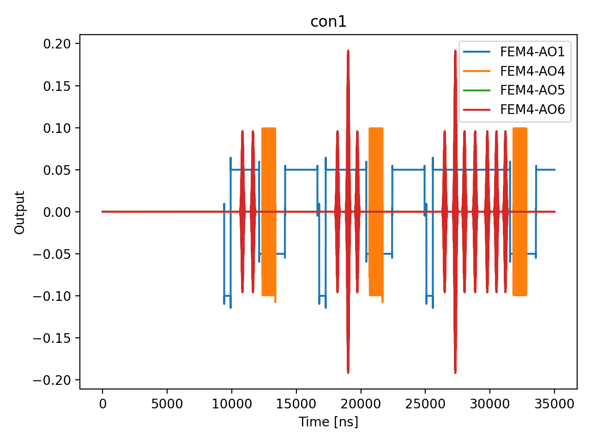

# 14_single_qubit_randomized_benchmarking

## Description

        SINGLE QUBIT RANDOMIZED BENCHMARKING (PPU-optimized)
The program plays random sequences of single-qubit Clifford gates and measures the
survival probability (return to ground state) afterward.  The 24 single-qubit
Cliffords are decomposed via Qiskit transpilation (basis: rx, ry, rz) into native
gates {x90, x180, -x90, y90, y180, -y90} plus virtual Z rotations
(frame_rotation_2pi, zero duration).

The PPU generates random Clifford circuits on-chip:
  1. PPU PHASE: For each circuit, random Cliffords are generated incrementally
     across depth checkpoints using preloaded composition and inverse tables.
  2. EXPERIMENT PHASE: For each (depth, shot), the pre-computed gate sequences
     are played back from arrays — no RNG or composition in the hot path.

Depth convention: depth d = d-1 random Cliffords + 1 recovery (inverse) = d total.
A single random circuit of max length is generated per circuit_idx; shorter depths
are truncations of the same circuit (standard RB truncation approach).

The survival probability vs circuit depth is fit to F(m) = A·α^m + B.  The average
error per Clifford is epc = (1 − α)·(d − 1)/d with d = 2, giving the average
Clifford gate fidelity F_avg = 1 − epc.

Prerequisites:
    - Having calibrated the sensor dots and resonators (nodes 2a, b, 3).
    - Having calibrated initialization, operation and PSB measurement points (nodes 4, 5).
    - Having calibrated π and π/2 pulse parameters (nodes 08a, 08b, 10a).
    - Native gate operations (x90, x180, -x90, y90, y180, -y90) defined on the qubit XY channel.

State update:
    - The averaged single qubit gate fidelity: qubit.gate_fidelity["averaged"].

## Parameters

| Parameter | Value | Description |
|-----------|-------|-------------|
| `delta_clifford` | `16` | Step between depths in linear scale mode. Default is 20. |
| `gap_wait_time_in_ns` | `2000` | Initialization hold time in nanoseconds (e.g. 400 µs). Default is 400_000. |
| `load_data_id` | `None` | Optional QUAlibrate node run index for loading historical data. Default is None. |
| `log_scale` | `False` | If True, use log-scale depths: 2, 4, 8, 16, ... up to max_circuit_depth. Default is True. |
| `max_circuit_depth` | `64` | Maximum circuit depth (total Clifford count). Default is 256. |
| `model_computed_fields` | `{}` |  |
| `model_config` | `{'extra': 'forbid', 'use_attribute_docstrings': True}` |  |
| `model_extra` | `None` |  |
| `model_fields` | `{'multiplexed': FieldInfo(annotation=bool, required=False, default=False, description='Whether to play control pulses, readout pulses and active/thermal reset at the same time for all qubits (True)\nor to play the experiment sequentially for each qubit (False). Default is False.'), 'use_state_discrimination': FieldInfo(annotation=bool, required=False, default=False, description="Whether to use on-the-fly state discrimination and return the qubit 'state', or simply return the demodulated\nquadratures 'I' and 'Q'. Default is False."), 'reset_wait_time': FieldInfo(annotation=int, required=False, default=5000, description='The wait time for qubit reset.'), 'qubits': FieldInfo(annotation=Union[List[str], NoneType], required=False, default=None, description='A list of qubit names which should participate in the execution of the node. Default is None.'), 'num_circuits_per_length': FieldInfo(annotation=int, required=False, default=50, description='Number of random circuits per depth. Default is 50.'), 'num_shots': FieldInfo(annotation=int, required=False, default=400, description='Number of repetitions (shots) per circuit. Default is 400.'), 'max_circuit_depth': FieldInfo(annotation=int, required=False, default=256, description='Maximum circuit depth (total Clifford count). Default is 256.'), 'delta_clifford': FieldInfo(annotation=int, required=False, default=20, description='Step between depths in linear scale mode. Default is 20.'), 'log_scale': FieldInfo(annotation=bool, required=False, default=True, description='If True, use log-scale depths: 2, 4, 8, 16, ... up to max_circuit_depth. Default is True.'), 'seed': FieldInfo(annotation=Union[int, NoneType], required=False, default=None, description='Seed for the QUA pseudo-random number generator. Default is None (random).'), 'gap_wait_time_in_ns': FieldInfo(annotation=int, required=False, default=400000, description='Initialization hold time in nanoseconds (e.g. 400 µs). Default is 400_000.'), 'operation_x90': FieldInfo(annotation=str, required=False, default='x90', description="Name of the π/2 X rotation operation on the xy channel. Default is 'x90'."), 'operation_x180': FieldInfo(annotation=str, required=False, default='x180', description="Name of the π X rotation operation on the xy channel. Default is 'x180'."), 'simulate': FieldInfo(annotation=bool, required=False, default=False, description='Simulate the waveforms on the OPX instead of executing the program. Default is False.'), 'simulation_duration_ns': FieldInfo(annotation=int, required=False, default=50000, description='Duration over which the simulation will collect samples (in nanoseconds). Default is 50_000 ns.'), 'use_waveform_report': FieldInfo(annotation=bool, required=False, default=True, description='Whether to use the interactive waveform report in simulation. Default is True.'), 'timeout': FieldInfo(annotation=int, required=False, default=120, description='Waiting time for the OPX resources to become available before giving up (in seconds). Default is 120 s.'), 'load_data_id': FieldInfo(annotation=Union[int, NoneType], required=False, default=None, description='Optional QUAlibrate node run index for loading historical data. Default is None.')}` |  |
| `model_fields_set` | `{'delta_clifford', 'log_scale', 'gap_wait_time_in_ns', 'simulate', 'reset_wait_time', 'max_circuit_depth', 'operation_x90', 'simulation_duration_ns', 'seed', 'qubits', 'num_circuits_per_length', 'num_shots', 'use_waveform_report', 'use_state_discrimination', 'load_data_id', 'multiplexed', 'timeout', 'operation_x180'}` |  |
| `multiplexed` | `False` | Whether to play control pulses, readout pulses and active/thermal reset at the same time for all qubits (True)
or to play the experiment sequentially for each qubit (False). Default is False. |
| `num_circuits_per_length` | `1` | Number of random circuits per depth. Default is 50. |
| `num_shots` | `1` | Number of repetitions (shots) per circuit. Default is 400. |
| `operation_x180` | `x180` | Name of the π X rotation operation on the xy channel. Default is 'x180'. |
| `operation_x90` | `x90` | Name of the π/2 X rotation operation on the xy channel. Default is 'x90'. |
| `qubits` | `['Q1']` | A list of qubit names which should participate in the execution of the node. Default is None. |
| `reset_wait_time` | `5000` | The wait time for qubit reset. |
| `seed` | `None` | Seed for the QUA pseudo-random number generator. Default is None (random). |
| `simulate` | `True` | Simulate the waveforms on the OPX instead of executing the program. Default is False. |
| `simulation_duration_ns` | `20000` | Duration over which the simulation will collect samples (in nanoseconds). Default is 50_000 ns. |
| `targets` | `['Q1']` |  |
| `targets_name` | `qubits` |  |
| `timeout` | `120` | Waiting time for the OPX resources to become available before giving up (in seconds). Default is 120 s. |
| `use_state_discrimination` | `False` | Whether to use on-the-fly state discrimination and return the qubit 'state', or simply return the demodulated
quadratures 'I' and 'Q'. Default is False. |
| `use_waveform_report` | `True` | Whether to use the interactive waveform report in simulation. Default is True. |

## Simulation Output

---
*Generated by simulation test infrastructure*
