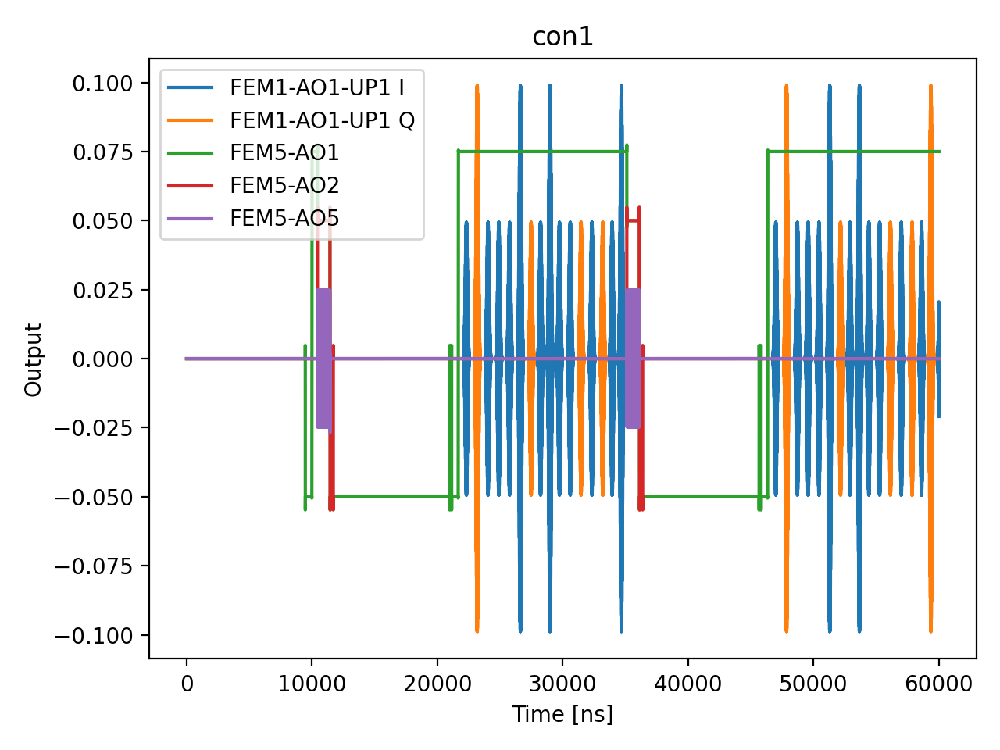

# 14_single_qubit_randomized_benchmarking

## Description

        SINGLE QUBIT RANDOMIZED BENCHMARKING (PPU-optimized)
The program plays random sequences of single-qubit Clifford gates and measures the
survival probability (return to ground state) afterward.  The 24 single-qubit
Cliffords are decomposed via Qiskit transpilation (basis: rx, ry, rz) into native
gates {x90, x180, -x90, y90, y180, -y90} plus virtual Z rotations
(frame_rotation_2pi, zero duration).

The PPU generates random Clifford circuits on-chip:
  1. PPU PHASE: For each circuit, random Cliffords are generated incrementally
     across depth checkpoints using preloaded composition and inverse tables.
  2. EXPERIMENT PHASE: For each (depth, shot), the pre-computed gate sequences
     are played back from arrays — no RNG or composition in the hot path.

Depth convention: depth d = d-1 random Cliffords + 1 recovery (inverse) = d total.
A single random circuit of max length is generated per circuit_idx; shorter depths
are truncations of the same circuit (standard RB truncation approach).

The survival probability vs circuit depth is fit to F(m) = A·α^m + B.  The average
error per Clifford is epc = (1 − α)·(d − 1)/d with d = 2, giving the average
Clifford gate fidelity F_avg = 1 − epc.

Prerequisites:
    - Having calibrated the sensor dots and resonators (nodes 2a, b, 3).
    - Having calibrated initialization, operation and PSB measurement points (nodes 4, 5).
    - Having calibrated π and π/2 pulse parameters (nodes 08a, 08b, 10a).
    - Native gate operations (x90, x180, -x90, y90, y180, -y90) defined on the qubit XY channel.

State update:
    - The averaged single qubit gate fidelity: qubit.gate_fidelity["averaged"].

TODO:
    Fix alignment/timing consistency between FEM output channels (LF vs MW) so pulses
    and background offsets line up across hardware and simulated RB waveforms.

## Parameters

| Parameter | Value | Description |
|-----------|-------|-------------|
| `multiplexed` | `False` | Whether to play control pulses, readout pulses and active/thermal reset at the same time for all qubits (True)
or to play the experiment sequentially for each qubit (False). Default is False. |
| `use_state_discrimination` | `False` | Whether to use on-the-fly state discrimination and return the qubit 'state', or simply return the demodulated
quadratures 'I' and 'Q'. Default is False. |
| `reset_wait_time` | `5000` | The wait time for qubit reset. |
| `qubits` | `['q1']` | A list of qubit names which should participate in the execution of the node. Default is None. |
| `num_circuits_per_length` | `1` | Number of random circuits per depth. Default is 50. |
| `num_shots` | `1` | Number of repetitions (shots) per circuit. Default is 400. |
| `max_circuit_depth` | `64` | Maximum circuit depth (total Clifford count). Default is 256. |
| `delta_clifford` | `16` | Step between depths in linear scale mode. Default is 20. |
| `log_scale` | `False` | If True, use log-scale depths: 2, 4, 8, 16, ... up to max_circuit_depth. Default is True. |
| `seed` | `None` | Seed for the QUA pseudo-random number generator. Default is None (random). |
| `operation_x90` | `x90` | Name of the π/2 X rotation operation on the xy channel. Default is 'x90'. |
| `operation_x180` | `x180` | Name of the π X rotation operation on the xy channel. Default is 'x180'. |
| `simulate` | `True` | Simulate the waveforms on the OPX instead of executing the program. Default is False. |
| `simulation_duration_ns` | `60000` | Duration over which the simulation will collect samples (in nanoseconds). Default is 50_000 ns. |
| `use_waveform_report` | `True` | Whether to use the interactive waveform report in simulation. Default is True. |
| `timeout` | `180` | Waiting time for the OPX resources to become available before giving up (in seconds). Default is 120 s. |
| `load_data_id` | `None` | Optional QUAlibrate node run index for loading historical data. Default is None. |

## Simulation Output

---
*Generated by simulation test infrastructure*
