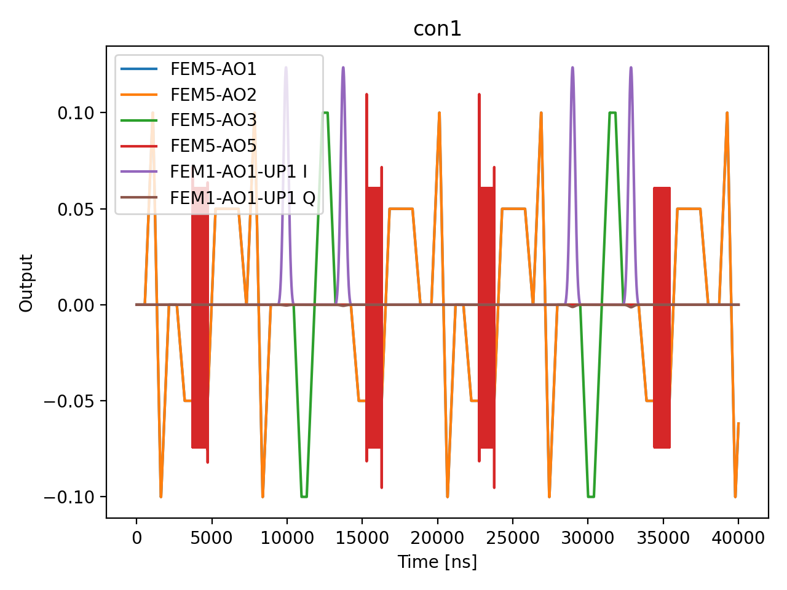

# 16_geometric_cz_calibration

## Description

        GEOMETRIC CZ GATE CALIBRATION - using standard QUA (pulse > 16ns and 4ns granularity)
The goal of this script is to calibrate a geometric controlled-Z (CZ) gate by finding the exchange pulse
amplitude and duration where the conditional phase equals pi and the SWAP oscillation completes a full 2pi
rotation (returning to the initial state with no population exchange).

A geometric CZ gate leverages the exchange interaction between two spin qubits. When the exchange coupling J
is pulsed, two effects occur simultaneously:
    1) SWAP oscillations: Population exchange between |up,down> and |down,up> states at frequency J.
    2) Conditional phase accumulation: The |up,up> and |down,down> states acquire phase relative to the
       antiparallel states.

For a perfect CZ gate (diag(1, 1, 1, -1)), we need:
    - Conditional phase = pi: The target qubit accumulates a pi phase shift when the control qubit is |up>
      relative to when it is |down>.
    - SWAP angle = 2*pi*n (integer n): The SWAP oscillation completes a full cycle, returning the population
      to its initial state with no net exchange.

This measurement performs a 2D sweep of exchange pulse amplitude vs duration with four experiment types:
    Experiments 0,1 (Phase): Ramsey on target qubit with control in |0> vs |1> to extract conditional phase.
    Experiments 2,3 (SWAP): Prepare |1,0> vs |0,1> and measure population oscillations to extract SWAP angle.

Prerequisites:
    - Having calibrated single-qubit gates (X90, X180) for both qubits.
    - Having calibrated the readout for the qubit pair (parity readout).
    - Having characterized the exchange coupling vs barrier voltage (from CROT spectroscopy).
    - Having set appropriate voltage points for initialization, operation, and exchange.

State update:
    - CZ voltage point on qubit pair (barrier gate voltage)
    - CZ macro duration

Pulse calibration:
    State preparation calls ``qubit_target.x90()`` / ``x180()`` and
    ``qubit_control.x180()``. Each resolves to that qubit’s QUAM macros (reference
    pulse and tuned amplitudes), so π and π/2 are the ones calibrated for that
    qubit—not a shared amplitude between dots.

## Parameters

| Parameter | Value | Description |
|-----------|-------|-------------|
| `analysis_signal` | `E_p2_given_p1_0` | Which conditional expectation to use for fitting.
E_p2_given_p1_0: P(second=1 | first=0) — post-select on empty dot.
E_p2_given_p1_1: P(second=1 | first=1) — post-select on loaded dot. |
| `multiplexed` | `False` | Whether to play control pulses, readout pulses and active/thermal reset at the same time for all qubits (True)
or to play the experiment sequentially for each qubit (False). Default is False. |
| `use_state_discrimination` | `False` | Whether to use on-the-fly state discrimination and return the qubit 'state', or simply return the demodulated
quadratures 'I' and 'Q'. Default is False. |
| `reset_wait_time` | `5000` | The wait time for qubit reset. |
| `qubit_pairs` | `['q1_q2']` | A list of qubit pair names which should participate in the execution of the node. Default is None. |
| `num_shots` | `1` | Number of averages to perform. Default is 100. |
| `min_exchange_duration_in_ns` | `200` | Minimum exchange pulse duration in nanoseconds. Must be >= 16 ns (4 clock cycles). Default is 16 ns. |
| `max_exchange_duration_in_ns` | `1000` | Maximum exchange pulse duration in nanoseconds. Default is 2000 ns. |
| `duration_step_in_ns` | `40` | Step size for the exchange pulse duration sweep in nanoseconds. Default is 20 ns. |
| `min_exchange_amplitude` | `0.1` | Minimum exchange pulse amplitude (virtual barrier gate voltage, V). Default is 0.0. |
| `max_exchange_amplitude` | `0.5` | Maximum exchange pulse amplitude (virtual barrier gate voltage, V). Default is 0.5. |
| `amplitude_step` | `0.05` | Step size for the exchange pulse amplitude sweep in Volts. Default is 0.01. |
| `simulate` | `True` | Simulate the waveforms on the OPX instead of executing the program. Default is False. |
| `simulation_duration_ns` | `40000` | Duration over which the simulation will collect samples (in nanoseconds). Default is 50_000 ns. |
| `use_waveform_report` | `True` | Whether to use the interactive waveform report in simulation. Default is True. |
| `timeout` | `120` | Waiting time for the OPX resources to become available before giving up (in seconds). Default is 120 s. |
| `load_data_id` | `None` | Optional QUAlibrate node run index for loading historical data. Default is None. |

## Simulation Output

---
*Generated by simulation test infrastructure*

## Area Under Curve (Mean Voltage per Channel)

| Controller | Port | Mean Voltage (V) |
|------------|------|------------------|
| con1 | 1-1-1 | 5.067793e-03 |
| con1 | 5-1 | 2.414328e-04 |
| con1 | 5-2 | 2.414328e-04 |
| con1 | 5-3 | -2.327920e-06 |
| con1 | 5-4 | 0.000000e+00 |
| con1 | 5-5 | -3.592526e-17 |
