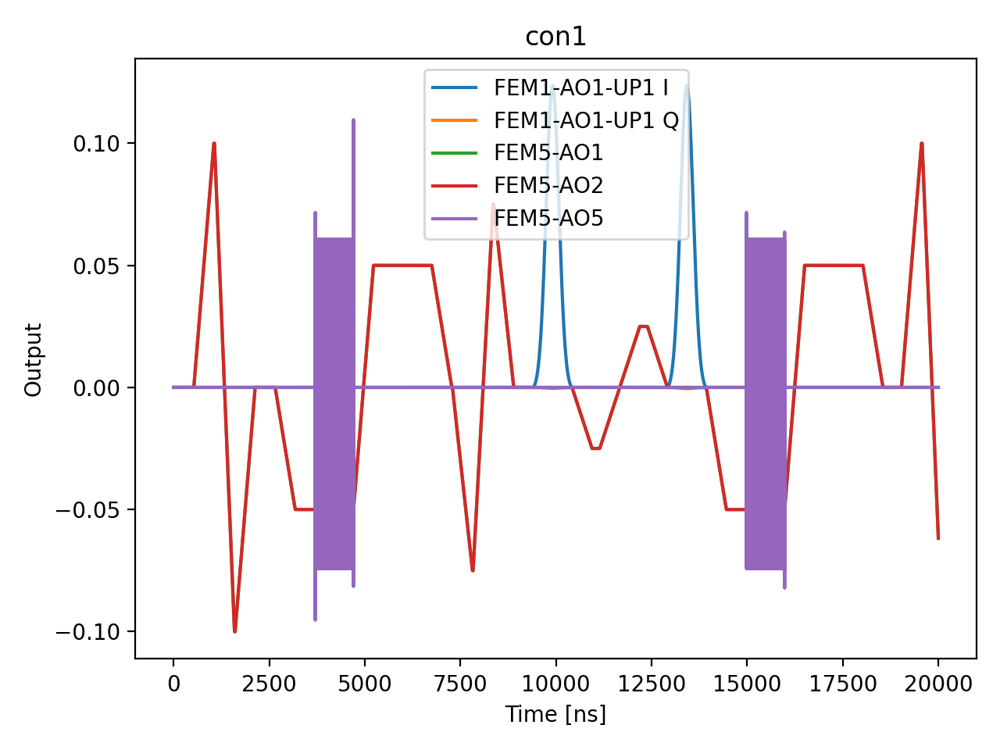

# 18_cz_phase_compensation

## Description

        CZ PHASE COMPENSATION - using standard QUA (pulse > 16ns and 4ns granularity)
This program calibrates and compensates the residual single-qubit (local Z) phase shifts induced by the
geometric CZ gate. After calibrating the CZ operating point (node 16), the physical exchange interaction
imparts unconditional Z phases on both qubits in addition to the desired conditional pi phase. These
unconditional phases must be cancelled by virtual Z (frame) rotations applied after each CZ gate.

The measurement uses a Ramsey-like sequence: X90 — CZ(swept frame rotation) — X90, with parity readout.
Sweeping the virtual frame rotation over a full 2pi produces a sinusoidal signal whose fitted phase gives
the residual phase error. Four experiment types are run per qubit pair:
    Experiment 0: Target in superposition, control in |0⟩ → target unconditional phase (correction)
    Experiment 1: Target in superposition, control in |1⟩ → target + conditional phase (cross-check)
    Experiment 2: Control in superposition, target in |0⟩ → control unconditional phase (correction)
    Experiment 3: Control in superposition, target in |1⟩ → control + conditional phase (cross-check)

The ground-state-partner experiments (0, 2) give the phase corrections. The excited-state-partner
experiments (1, 3) verify that the conditional phase is pi.

Prerequisites:
    - Having calibrated single-qubit gates (X90, X180) for both qubits.
    - Having calibrated the readout for the qubit pair (parity readout).
    - Having calibrated the CZ gate operating point (node 16): conditional phase ~pi, SWAP ~2pi.

State update:
    - CZ macro phase_shift_control
    - CZ macro phase_shift_target

## Parameters

| Parameter | Value | Description |
|-----------|-------|-------------|
| `analysis_signal` | `E_p2_given_p1_0` | Which conditional expectation to use for fitting.
E_p2_given_p1_0: P(second=1 | first=0) — post-select on empty dot.
E_p2_given_p1_1: P(second=1 | first=1) — post-select on loaded dot. |
| `multiplexed` | `False` | Whether to play control pulses, readout pulses and active/thermal reset at the same time for all qubits (True)
or to play the experiment sequentially for each qubit (False). Default is False. |
| `use_state_discrimination` | `False` | Whether to use on-the-fly state discrimination and return the qubit 'state', or simply return the demodulated
quadratures 'I' and 'Q'. Default is False. |
| `reset_wait_time` | `5000` | The wait time for qubit reset. |
| `qubit_pairs` | `['q1_q2']` | A list of qubit pair names which should participate in the execution of the node. Default is None. |
| `num_shots` | `1` | Number of averages to perform. |
| `num_frames` | `3` | Number of frame rotation points in [0, 1). More points improve sinusoid fit quality. |
| `conditional_phase_tolerance` | `0.15` | Tolerance for the conditional phase cross-check (units of 2pi).
If |measured_conditional_phase - pi| > tolerance * 2*pi, a warning is logged. |
| `simulate` | `True` | Simulate the waveforms on the OPX instead of executing the program. Default is False. |
| `simulation_duration_ns` | `20000` | Duration over which the simulation will collect samples (in nanoseconds). Default is 50_000 ns. |
| `use_waveform_report` | `True` | Whether to use the interactive waveform report in simulation. Default is True. |
| `timeout` | `500` | Waiting time for the OPX resources to become available before giving up (in seconds). Default is 120 s. |
| `load_data_id` | `None` | Optional QUAlibrate node run index for loading historical data. Default is None. |

## Simulation Output

---
*Generated by simulation test infrastructure*

## Area Under Curve (Mean Voltage per Channel)

| Controller | Port | Mean Voltage (V) |
|------------|------|------------------|
| con1 | 1-1-1 | 5.067894e-03 |
| con1 | 5-1 | 1.785621e-03 |
| con1 | 5-2 | 1.785621e-03 |
| con1 | 5-3 | 0.000000e+00 |
| con1 | 5-4 | 0.000000e+00 |
| con1 | 5-5 | -6.065128e-16 |
